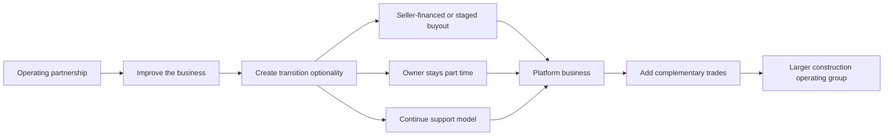

# Business Model

## Phase 1: Operating Partnership

The operating team enters a structured support relationship with the owner-partner business. The team helps improve business performance before any full acquisition decision is required.

Potential support areas:

- marketing and local digital presence
- lead intake and qualification
- quoting and estimating
- scheduling and project management
- customer communication
- job-site coordination
- recruiting and people management
- financial reporting
- vendor and subcontractor management
- standard operating procedures

## Phase 2: Transition Optionality

If trust, performance, and financial transparency improve, the parties evaluate transition options:

- seller-financed purchase
- staged buyout
- earnout-based transition
- management services agreement with purchase option
- long-term employment or advisory role for the original owner
- no acquisition if the partnership creates value but ownership transfer is not attractive

## Phase 3: Platform Expansion

After the first business is stabilized, the operating team may add complementary businesses or trades, such as:

- electrician
- plumber
- HVAC
- finishing/remodeling
- framing/carpentry
- concrete/masonry
- roofing/exteriors

The goal is not to bolt together random trades. The goal is to create a trusted operating group with shared standards, shared lead flow, shared scheduling discipline, shared project management, and a dependable labor bench.

## Incentive Requirement

The business model only works if cooperation is rational for every major participant. The owner should gain time, income, dignity, and upside. The operating team should be compensated for real work and value creation. Workers should gain stability, higher earnings, training, and a career path. Customers should receive better service. Investors should receive de-risked exposure to measurable cash-flow improvement.

See [01-strategy/incentive-design.md](/Users/fszale/projects/personal/construction-operational-plan/01-strategy/incentive-design.md) for the game-theory design.

## Business Model Path

