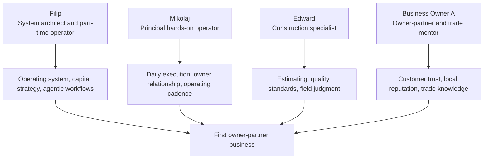

# Initial Participants

## Filip - Operator and System Architect

Filip owns multiple businesses and is the architect of the operating system concept. He is expected to support the project part time and contribute to strategy, systems design, agentic operations, financial discipline, investor narrative, and high-leverage operating decisions.

Key constraints:

- part-time operator with full weekends available and roughly one hour every afternoon on weekdays
- should not become the bottleneck for daily execution
- highest leverage is system design, capital strategy, and operating cadence

## Mikolaj - Principal Operator

Mikolaj is expected to be the principal hands-on operator across the business. He carries more day-to-day responsibility for execution, owner relationship management, internal operating cadence, follow-through, and cross-functional coordination.

Key constraints:

- weekly time commitment still to be determined
- needs clear authority and operating rhythm
- should be supported by tools, checklists, and agentic workflows
- must avoid becoming trapped in low-value administrative work

## Edward - Construction Specialist

Edward brings deep construction trade experience, estimating and quoting knowledge, client relations experience, and hands-on operating judgment.

Key constraints:

- weekly time commitment still to be determined
- role should focus on high-judgment construction work, estimating standards, quality control, trade supervision, and customer trust
- should help codify field knowledge into repeatable training and quality systems

## Business Owner A - First Owner-Partner

Business Owner A is an aging owner-operator of a construction business. The ideal profile is someone with local reputation, trade competence, customer relationships, and a desire to exit gradually, but without a clear family succession path.

Potential role over time:

- initial owner and operator
- mentor and quality advisor
- part-time business development or estimating contributor
- seller-financing counterparty
- indefinitely employed senior advisor if mutually attractive

## Initial Role Map

