# Vision

Build a construction operating group that helps strong but succession-constrained owner-operated businesses become more professional, more profitable, more resilient, and easier for owners to transition out of over time.

The first wedge is not a traditional acquisition search. It is an operating partnership with an aging owner who still has trade knowledge, customer trust, and local reputation, but may lack the energy, systems, digital presence, or succession path needed for the next chapter.

## Working Thesis

Filip, Mikolaj, and Edward form the initial operating team. They identify a hands-on construction business owner who is looking to retire gradually, has no natural family succession plan, and is willing to stay involved part time while the operating team helps improve the business.

The operating team supports day-to-day operations, marketing, quoting, estimating, customer follow-up, people management, job-site execution, project management, financial visibility, and digital presence. Over 12 to 18 months, the team aims to improve revenue, profitability, and operating reliability enough to create trust and optionality.

## Long-Term Ambition

Create a sizable, professionally run construction services company with more than $5 million in annual revenue, strong cash flow, a dependable people pipeline, and a repeatable acquisition and integration system.

The company may later become:

- a long-term cash-flow vehicle retained by the operating team
- a platform for additional trade acquisitions
- an acquisition target for private equity or a strategic buyer
- a professional home for retiring owners who still want part-time involvement

## Core Design Principle

Use systems over goals. Growth targets matter only if they are backed by repeatable operating mechanisms:

- lead generation system
- intake and qualification system
- estimating and quoting system
- project management system
- field quality system
- hiring and training system
- financial reporting system
- agent-assisted administrative system

## Value Creation Flywheel

```mermaid
flowchart LR
  Owner["Owner trust and trade knowledge"] --> Access["Operating access"]
  Access --> Systems["Professional systems"]
  Systems --> Performance["Better revenue, margin, and reliability"]
  Performance --> Trust["More owner delegation"]
  Trust --> Transferability["Less owner dependency"]
  Transferability --> Options["Acquisition or long-term partnership options"]
  Options --> Platform["Repeatable platform playbook"]
  Platform --> Search["Next owner-partner search"]
  Search --> Owner
```

