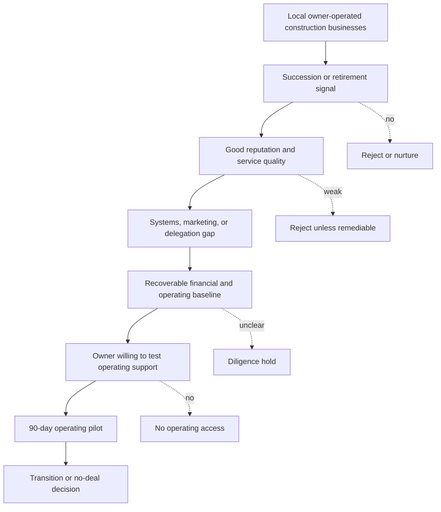

# Acquisition Thesis

## Target

Owner-operated construction businesses where the current owner has trade knowledge, customer goodwill, and local reputation, but lacks a succession path, modern operating systems, or energy for the next growth phase.

The first search geography is Southeast Michigan, with emphasis on wealthier Detroit suburbs such as Macomb, Chesterfield, Rochester, Shelby Township, Bloomfield, Commerce, Novi, Northville, and similar communities.

## Why This Opportunity Exists

Many small trade businesses are built around the owner. That creates fragility:

- owner handles sales, estimating, scheduling, quality, hiring, and customer issues
- business may have weak digital presence despite strong field skill
- financial reporting may be cash-based or informal
- crew knowledge may be tribal rather than documented
- owner may be tired but unable to exit without harming employees, customers, or reputation

## What The Operating Team Adds

- professional marketing and lead capture
- better response speed and customer communication
- disciplined quoting and estimating
- job costing and financial visibility
- hiring, onboarding, and performance systems
- project management cadence
- technology and agent-assisted administrative support
- owner transition plan that preserves trust

## Target Selection Criteria

Ideal first business:

- owner wants to step back gradually
- owner is respected and willing to teach
- business has real customer demand
- service quality is good but systems are weak
- revenue base is meaningful enough to support operating effort
- licensing and insurance posture can be made clean
- financial records are available or recoverable
- team has capacity to improve operations within 12 to 18 months

Avoid:

- hidden legal disputes
- unsafe job-site culture
- severe licensing problems
- reputation damage
- owner unwilling to share information
- business dependent on one customer
- business with no crew reliability
- acquisition price based on unvalidated future upside

## Screening Funnel

