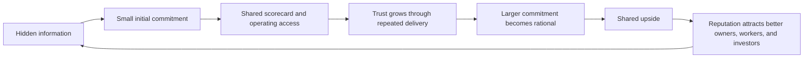
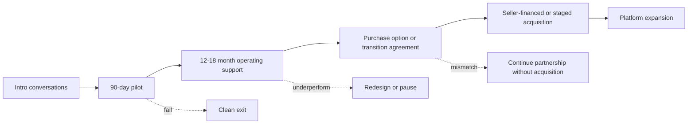
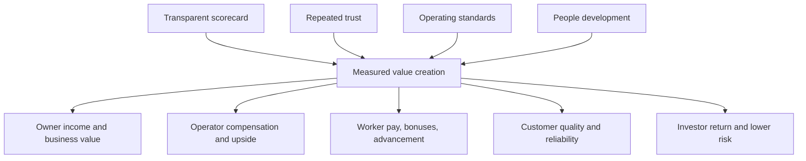

# Incentive Design And Game Theory

## Purpose

The system should be designed as a repeated cooperative game where every serious participant has a rational reason to keep contributing, share information, protect quality, and compound value over time.

The goal is not for one party to extract the most value in a single transaction. The goal is to make cooperation the dominant strategy for:

- the retiring owner
- the operating team
- field workers and subcontractors
- customers
- add-on business owners
- capital partners or investors

## Core Game-Theory Frame

Most small-business acquisitions fail or underperform when the game is structured as a one-time negotiation with hidden information. This project should instead be structured as a repeated game with staged commitments.

## Design Principles

### 1. Repeated Game Over One-Time Deal

Start with operating support, baseline measurement, and short-cycle scorecards before any acquisition. Each party earns the right to deeper commitment.

Why it matters:

- reduces adverse selection
- lets the owner test the team
- lets the team test the business
- reduces pressure to price a business before the truth is visible

### 2. Skin In The Game For Everyone

Participants should have upside tied to the value they help create, but not so much downside that one bad project can destroy them.

Examples:

- owner keeps income, dignity, role, and upside from improved business value
- operating team earns compensation for work plus upside for measurable improvement
- workers earn more through reliability, quality, training, and leadership growth
- investors earn returns from de-risked cash-flow improvement, not speculative hype

### 3. Transparent Scorekeeping

The system needs shared metrics because hidden scorekeeping creates suspicion.

Minimum shared scorecard:

- revenue
- gross margin
- net profit or seller discretionary earnings
- owner hours
- leads and close rate
- customer satisfaction and reviews
- rework and callbacks
- crew reliability
- cash flow and receivables
- safety and compliance issues

### 4. Staged Commitment

Commitment should increase only after evidence improves.

### 5. No Hostage Situations

No participant should be forced to stay because leaving is impossible. Good games have credible exits.

Required exits:

- owner can decline acquisition after pilot
- operating team can walk away from bad information or unsafe culture
- workers can see clear expectations and fair compensation
- investors can understand capital protections, reporting, and governance
- customers remain protected if ownership changes

## Stakeholder Win Conditions

| Stakeholder | What They Need To Win Big | What They Risk | Incentive Mechanism |
| --- | --- | --- | --- |
| Business Owner A | More time, preserved legacy, continued income, improved business value, dignified transition. | Loss of control, bad buyer, employee/customer harm, underpriced sale. | Staged operating support, transparent metrics, seller financing with protections, advisory role, optionality. |
| Filip | Scalable system, cash-flow asset, investor-ready platform, limited time burden. | Becoming the bottleneck, hidden liabilities, distraction from other businesses. | System design role, dashboards, delegation, agentic workflows, governance gates. |
| Mikolaj | Principal operating role, meaningful compensation, leadership growth, equity or upside potential. | Being overloaded, unclear authority, operational blame without control. | Clear operating authority, compensation tied to value creation, defined cadence, support systems. |
| Edward | Reward for trade expertise, respect, selective hands-on involvement, knowledge legacy. | Being pulled into every job, uncompensated expertise transfer. | Estimating/quality leadership role, training content ownership, bonus for margin and quality improvement. |
| Workers | Better pay, stable pipeline, training, respect, advancement, safer work. | Exploitation, chaotic scheduling, low-quality peers, no career path. | Scorecard-based raises, training ladder, predictable work, quality bonuses, leadership track. |
| Customers | Better communication, quality, schedule reliability, clean job sites, trustworthy warranty. | Poor workmanship, delays, unclear scope, ownership transition confusion. | Project management standards, documented scope, review loop, quality checks. |
| Investors | De-risked cash-flow returns, repeatable acquisition playbook, transparent reporting. | Overpaying, operator dependency, hidden liabilities, weak controls. | Milestone-based capital, governance, reporting, diligence gates, seller financing. |
| Add-On Owners | Exit path, preserved reputation, access to shared systems, less admin burden. | Loss of identity, integration failure, employee churn. | Integration playbook, role options, shared upside, staged transition. |

## Anti-Defection Mechanisms

The system should make short-term opportunism less attractive than continued cooperation.

| Risky Move | Prevention Mechanism |
| --- | --- |
| Owner hides financial or operational problems. | Start with pilot, require baseline data, delay acquisition pricing until transparency improves. |
| Operating team extracts value without respecting owner legacy. | Define owner protections, role, communication norms, and transition gates. |
| Workers cut quality to move faster. | Quality scorecard, callback tracking, bonuses tied to clean completion, not only speed. |
| Operators chase growth at the expense of cash flow. | Job-costing, cash review, margin gates, monthly financial close. |
| Investor pushes premature acquisition. | Milestone-based funding and proof requirements. |
| Add-on business resists integration. | Staged integration, clear local identity policy, shared standards, owner role design. |

## Payoff Architecture

## Compensation Concepts To Explore

These are concepts for modeling, not final terms.

### Owner-Partner

- base owner compensation during transition
- profit participation during support period
- seller note with downside protections and upside if targets are exceeded
- paid advisory or estimating role
- legacy protections around brand, customers, and employees

### Operating Team

- modest fixed compensation for real operating work
- performance bonus tied to verified improvement
- equity or option rights only after trust and baseline validation
- clear role-based economics for Filip, Mikolaj, and Edward

### Workers And Field Leaders

- reliable base pay
- quality bonus tied to callbacks, customer feedback, and schedule adherence
- training-level pay bands
- foreman or crew-lead path
- referral bonuses for dependable hires

### Investors

- capital deployed against specific acquisition or improvement milestones
- preferred return or structured yield where appropriate
- governance rights tied to major decisions
- reporting rights
- downside protection through seller financing, asset coverage, or staged funding

## Practical Rule

Do not ask anyone to take a bigger risk than the system has earned through evidence.

The first partnership should be designed to let everyone say:

- "I am better off continuing than defecting."
- "The upside is worth the work."
- "The downside is understood and bounded."
- "The scorecard is fair."
- "The next stage is earned, not forced."

