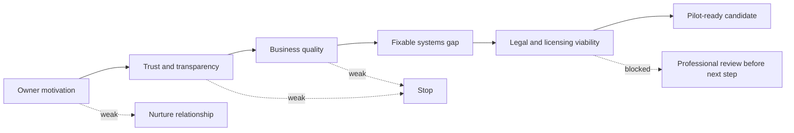

# Owner-Partner Profile

## Purpose

Define the first owner-partner target clearly enough that Filip, Mikolaj, Edward, contributors, and agents can evaluate opportunities consistently.

## Ideal Owner

The ideal first owner-partner:

- is aging or wants to reduce day-to-day operating burden
- has no clear family or internal succession path
- is still respected by customers, employees, and local referral sources
- has real trade knowledge and practical judgment
- cares about legacy, employees, customers, and reputation
- is willing to share operating and financial truth gradually
- is open to part-time future involvement
- values trust and continuity more than maximizing a one-time sale price

## Ideal Business

The ideal first business:

- serves Southeast Michigan, especially wealthier Detroit suburbs such as Macomb, Chesterfield, Rochester, Shelby Township, Bloomfield, Commerce, Novi, Northville, and similar markets
- has proven local demand
- has service quality worth preserving
- has weak or inconsistent systems that can be improved
- has enough revenue base to justify operator effort
- has margin improvement opportunity
- has recoverable financial records
- has licenses and insurance that are clean or fixable
- has a crew or subcontractor base that can be stabilized
- has a customer base that would respond to better communication and digital presence

## Minimum Screening Criteria

| Area | Minimum Standard |
| --- | --- |
| Owner motivation | Clear desire to reduce burden or plan transition. |
| Reputation | No obvious pattern of serious customer distrust. |
| Financials | At least enough records to reconstruct baseline revenue, margins, and owner compensation. |
| Legal and licensing | No unfixable licensing, insurance, lien, or safety issue discovered early. |
| Operating access | Owner willing to test structured support and share core operating data. |
| Service category | Service has repeat demand, clear scope, and visible quality differentiation. |
| Geography | Serves Southeast Michigan wealthier suburbs or can expand into them. |
| People | Existing workers or subcontractors are not irreparably unreliable. |

## Red Flags

- owner refuses basic financial visibility
- unresolved legal or licensing problems
- unsafe job-site culture
- severe reputation damage
- pricing depends on hiding risk or underpaying labor
- key work depends on one person who will immediately leave
- customer concentration creates existential risk
- seller demands acquisition price before pilot evidence
- owner says they want help but will not delegate anything meaningful

## First Conversation Questions

- What would you like your life to look like 12 to 24 months from now?
- What parts of the business still energize you?
- What parts of the business are wearing you down?
- What would make you trust someone else with customers, workers, and reputation?
- If your business improved, would you prefer to keep owning it, sell it gradually, or stay involved part time?
- What would a bad transition look like to you?
- What do you want protected no matter what?

## Fit Decision

