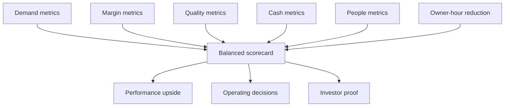

# KPI Scorecard

## Purpose

Create transparent scorekeeping so cooperation remains rational for the owner, operators, workers, customers, and future investors.

## Scorecard Rules

- Define metrics before incentives are attached.
- Use the same scorecard in owner reviews, operator reviews, and investor materials.
- Separate leading indicators from lagging financial results.
- Do not reward speed without quality.
- Do not reward revenue growth that destroys margin or cash flow.

## Weekly Metrics

| Metric | Why It Matters | Owner | Target Direction |
| --- | --- | --- | --- |
| New leads | Shows demand and marketing reach. | Marketing / Mikolaj | Up |
| Speed to first response | Major conversion lever. | Mikolaj | Faster |
| Appointments booked | Converts raw demand into sales opportunity. | Mikolaj | Up |
| Estimates sent | Shows quoting throughput. | Edward / Mikolaj | Up with quality |
| Estimate follow-ups completed | Prevents leakage after quoting. | Mikolaj | Up |
| Jobs in progress | Shows active workload. | Mikolaj | Stable and visible |
| Schedule conflicts | Reveals capacity and planning issues. | Mikolaj | Down |
| Customer issues open | Protects trust and reviews. | Mikolaj / Edward | Down |
| Recruiting pipeline | Tracks people constraint. | Mikolaj | Up |

## Monthly Metrics

| Metric | Why It Matters | Owner | Target Direction |
| --- | --- | --- | --- |
| Revenue | Measures growth. | Finance owner | Up |
| Gross margin | Measures pricing and execution quality. | Finance / Edward | Up |
| Net profit or SDE | Measures owner economics. | Finance owner | Up |
| Cash balance | Prevents growth from hiding liquidity stress. | Finance owner | Stable or up |
| Receivables aging | Flags collection risk. | Finance owner | Down |
| Close rate | Measures sales effectiveness. | Mikolaj | Up |
| Average project value | Shows offer and pricing quality. | Marketing / Edward | Up if margin-safe |
| Rework and callbacks | Measures quality. | Edward | Down |
| Customer reviews | Measures trust and reputation. | Marketing / Mikolaj | Up |
| Owner hours | Measures transition progress. | Owner / Mikolaj | Down |

## Incentive Connection

Incentives should be based on a balanced scorecard:

- revenue growth
- gross margin
- cash collection
- customer satisfaction
- quality and callback reduction
- owner-hour reduction
- worker reliability and retention

No one should earn major performance upside from a single metric that can be gamed.

