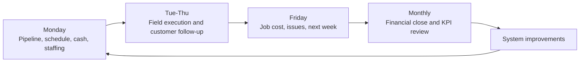

# Operating Model

## First 12 To 18 Month Objective

Use the first owner-partner business to prove that the operating team can improve business performance while reducing owner burden and preserving service quality.

Working goals:

- improve revenue by roughly 25 percent
- improve profitability by roughly 20 percent
- reduce owner day-to-day burden
- establish repeatable operating cadence
- build dependable people pipeline
- create clean reporting
- document the transition playbook

These are assumptions until baseline data is collected.

## Pareto Control Points

The operating team should initially focus on the few control points most likely to produce value:

1. Lead intake and response speed
2. Quote quality, follow-up, and close rate
3. Gross margin and job-costing discipline
4. Schedule reliability and project throughput
5. Crew quality, accountability, and rework reduction
6. Customer communication and review generation
7. Owner delegation and operating cadence

## Weekly Operating Rhythm

- Monday: pipeline, schedule, staffing, cash, and active project review
- Tuesday to Thursday: field execution, estimate follow-up, recruiting, customer communication
- Friday: job-cost review, issues list, owner transition review, next-week plan
- Monthly: financial close, KPI review, hiring pipeline review, systems improvement review

## Core KPIs

- leads received
- speed to first response
- estimate appointments booked
- estimates sent
- estimate close rate
- average project value
- gross margin by job
- labor utilization
- schedule adherence
- rework or callback rate
- customer review count and rating
- owner hours per week
- cash balance and receivables
