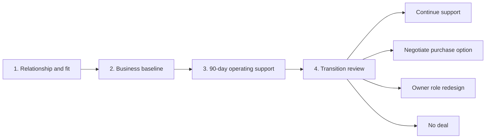

# Owner Onboarding Playbook

## Purpose

Onboard the first owner-partner in a way that builds trust, reduces risk, and gives the operating team enough visibility to help.

## Stage 1: Relationship And Fit

- understand owner goals
- understand family succession situation
- map owner responsibilities
- clarify whether the owner wants income, time freedom, legacy preservation, full exit, or all of the above
- identify non-negotiables

## Stage 2: Business Baseline

Collect:

- last 3 years revenue and profit
- current backlog
- active leads
- price list or estimating method
- customer segments
- crew list and subcontractor list
- insurance and licenses
- current software stack
- current marketing channels
- customer reviews and reputation

## Stage 3: 90-Day Operating Support

Initial improvements:

- centralize leads
- standardize estimate follow-up
- review pricing and gross margin
- implement weekly job review
- clean up customer communication
- document top recurring workflows
- identify people risks

## Stage 4: Transition Decision

After operating together:

- decide whether to continue support
- decide whether to negotiate purchase option
- decide whether owner role should change
- decide whether legal, financial, and diligence work should begin

## Stage Gates

