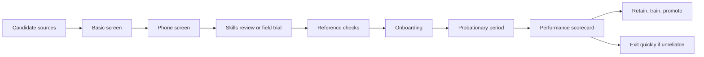

# People System

## Core Belief

The number one constraint in trades is dependable, high-quality people. The company must build a people system before growth overwhelms execution.

## Candidate Pipeline

Sources to test:

- referrals from existing crews
- trade schools
- local Facebook groups
- Indeed and similar job boards
- subcontractor relationships
- suppliers and material yards
- veteran and second-career programs
- apprenticeship channels

## Selection Process

Minimum process:

1. Basic screen for availability, experience, transportation, and work authorization.
2. Phone screen for attitude, reliability, and communication.
3. Skills review or field trial where legally and practically appropriate.
4. Reference checks.
5. Clear compensation and expectations.
6. Probationary period with documented feedback.

## Onboarding

Every worker should understand:

- safety expectations
- quality standards
- customer communication rules
- job-site cleanliness
- time tracking
- photo documentation
- escalation path
- no-surprise policy for scope, delays, or mistakes

## Performance System

Track:

- attendance reliability
- quality defects
- callbacks
- customer feedback
- schedule adherence
- willingness to follow process
- ability to work with others
- readiness for more responsibility

## People Pipeline

