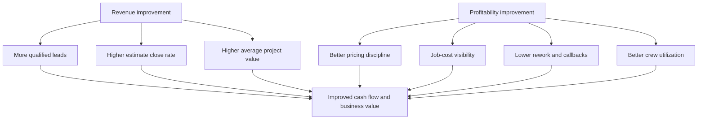

# Economic Targets

## Working Targets

The first launch target is to improve the first owner-partner business over 12 to 18 months:

- revenue improvement: roughly 25 percent
- profitability improvement: roughly 20 percent
- owner hours: materially reduced
- reporting: monthly financial visibility
- business value: increased through reduced owner dependency and cleaner systems

## Required Baseline

Before targets can be treated seriously, collect:

- trailing 36 months revenue
- gross margin by job type
- net income or seller discretionary earnings
- owner compensation
- backlog
- lead source performance
- estimate close rate
- average project value
- labor cost
- material cost
- subcontractor cost
- callbacks and warranty cost
- accounts receivable
- debt and liabilities

## Value Creation Levers

- raise lead volume
- improve lead response
- improve quote close rate
- improve pricing discipline
- reduce rework
- improve schedule utilization
- reduce unbilled change orders
- improve procurement
- professionalize reviews and referrals
- reduce owner dependency

## Shared Upside Model

The financial model should not only ask "how much value is created?" It should ask "who helped create the value, who took risk, and what payoff keeps them cooperating?"

Minimum model outputs:

- owner compensation during transition
- operator compensation during support period
- performance bonus pool
- worker bonus and advancement pool
- reinvestment reserve
- debt service or seller-note capacity
- investor return sensitivity
- downside case if revenue or margin targets are missed

The model should avoid incentive cliffs where one party captures nearly all upside while another carries operational burden.

## Financial Improvement Logic

