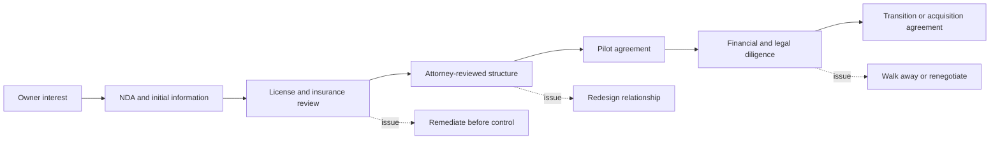

# Liability And Risk

This file is a planning checklist, not legal advice.

## Risk Areas

- licensing
- insurance
- worker classification
- employment law
- subcontractor agreements
- customer contracts
- warranties
- job-site safety
- vehicle and equipment liability
- debt and liens
- acquisition liabilities
- seller-financing terms
- use of existing business name and reputation

## Early Professional Reviews

Before operating authority or acquisition steps:

- attorney review of relationship structure
- insurance review
- licensing review
- accounting review
- tax review
- HR and employment compliance review

## Possible Structures To Explore

- management services agreement
- consulting agreement
- revenue share
- profit share
- purchase option
- staged equity purchase
- seller-financed acquisition
- asset purchase
- membership interest purchase

Each structure has different control, liability, tax, and diligence implications.

## Risk Gate Sequence

