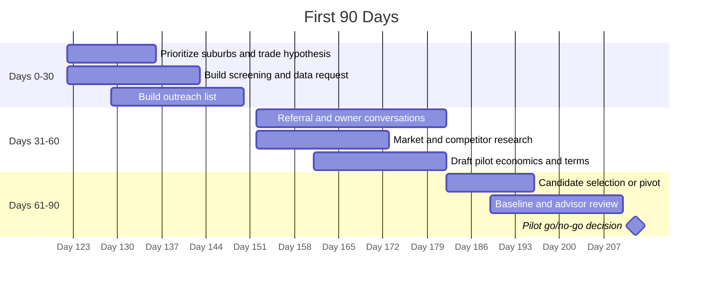

# 30/60/90 Launch Plan

## Purpose

Move the concept from plan to action without prematurely committing to a bad deal, unclear role structure, or unvalidated market.

The first 90 days should produce:

- prioritized Southeast Michigan suburb list and first trade hypothesis
- owner-partner screening criteria
- outreach list
- baseline data request
- 90-day pilot structure for attorney/accountant review
- initial operating scorecard
- first conversations with potential owner-partners or referral sources

## Roles

| Person | Primary 90-Day Role |
| --- | --- |
| Filip | System architect, capital/deal logic, agentic workflow, weekly review, investor narrative. Available full weekends and roughly one hour every weekday afternoon. |
| Mikolaj | Principal operator, outreach execution, owner relationship development, operating cadence design. Time commitment to be determined. |
| Edward | Trade evaluation, estimating standards, quality standards, owner credibility, field diligence. Time commitment to be determined. |
| Business Owner A | Not yet identified; target of search and eventual pilot. |
| Agents | Research, screening drafts, financial modeling, document synthesis, competitor review. |
| Professional advisors | Attorney, CPA, insurance, licensing, HR review when a real candidate emerges. |

## Days 0-30: Define And Prepare

Goal: make the idea clear enough to discuss with serious people.

| Workstream | Owner | Output |
| --- | --- | --- |
| Prioritize Southeast Michigan suburb list and first trade hypothesis | Filip / Mikolaj / Edward | Ranked suburb list and trade options. |
| Define owner-partner profile | Mikolaj / Edward | Updated `01-strategy/owner-partner-profile.md`. |
| Build outreach/referral list | Mikolaj | List of brokers, suppliers, trade contacts, owners, accountants, attorneys. |
| Build baseline data request | Finance agent / Filip | Updated `04-finance/baseline-data-request.md`. |
| Define KPI scorecard | Filip / Mikolaj | Updated `02-operations/kpi-scorecard.md`. |
| Draft pilot structure questions | Filip | Attorney/accountant review brief. |
| Launch agent workstreams | Filip | Assign tasks from `.agents/tasks/inbox/`. |
| Draft owner conversation script | Mikolaj / Edward | First-call question set. |

### Day 30 Exit Criteria

- first 10 Southeast Michigan outreach zones selected
- first trade category selected or narrowed to two
- Mikolaj and Edward time commitments confirmed
- screening checklist ready
- data request ready
- outreach list has at least 25 names or sources
- legal/accounting questions identified
- weekly internal review cadence scheduled

## Days 31-60: Market Test And Relationship Building

Goal: test whether the target owner profile exists and whether the pitch resonates.

| Workstream | Owner | Output |
| --- | --- | --- |
| Conduct referral conversations | Mikolaj | Notes from brokers, suppliers, trade contacts, accountants, attorneys. |
| Conduct owner discovery calls | Mikolaj / Edward | Owner fit notes and next-step recommendations. |
| Review trade quality and market fit | Edward | Trade-risk notes and first-wedge recommendation. |
| Model rough economics | Filip / Finance agent | First operating support and acquisition economics model. |
| Test digital presence opportunity | Marketing agent | Competitor and website gap summary. |
| Draft 90-day pilot terms | Filip / Advisors | Non-binding term outline for professional review. |
| Define people-pipeline experiment | Mikolaj | First recruiting channel test plan. |

### Day 60 Exit Criteria

- at least 10 serious referral or owner conversations completed
- 3 to 5 candidate businesses identified or clear evidence the wedge/geography should change
- first draft pilot structure reviewed internally
- first draft economic model created
- advisor review needs identified
- operating scorecard ready for a pilot

## Days 61-90: Pilot Candidate And Launch Readiness

Goal: identify a real pilot candidate or make a disciplined pivot.

| Workstream | Owner | Output |
| --- | --- | --- |
| Select top candidate or pivot | Filip / Mikolaj / Edward | Candidate decision memo. |
| Request baseline data under appropriate confidentiality | Mikolaj / Advisor | Data room or shared file list. |
| Review legal, insurance, licensing risks | Advisors | Go/no-go risk notes. |
| Build 90-day operating pilot plan | Mikolaj / Edward | Function-by-function support plan. |
| Set scorecard baseline | Finance agent / Mikolaj | KPI baseline and reporting cadence. |
| Confirm compensation and incentive concepts | Filip / Advisors | Draft economics for pilot period. |
| Decide next-stage commitment | Operating team | Continue, pause, pivot, or negotiate pilot. |

### Day 90 Exit Criteria

One of these should be true:

- a pilot candidate is ready for professional-reviewed terms
- a candidate is promising but needs more diligence
- the team has evidence to pivot geography, trade, or deal structure
- the concept is paused because the assumptions are not validating

## After 90 Days

If a pilot candidate is ready:

- execute professional-reviewed pilot agreement
- run weekly scorecard
- improve lead intake, quoting, scheduling, quality, and cash visibility
- reassess at 30, 60, and 90 days inside the pilot
- decide whether to continue into a 12 to 18 month improvement plan

If no pilot candidate is ready:

- update assumptions
- choose a revised target wedge
- rerun the 30/60/90 cycle with better screening data

## First 90-Day Cadence

