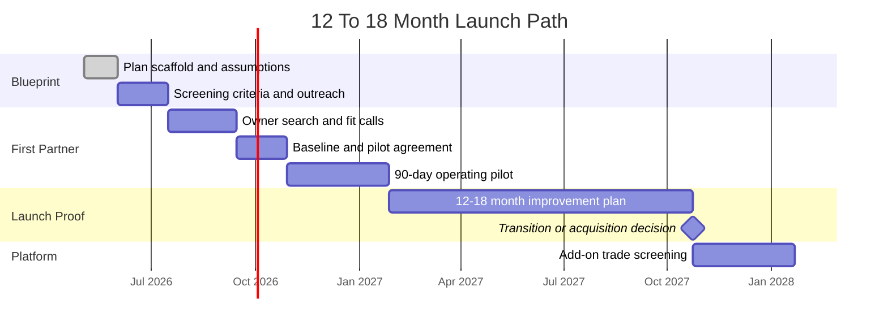

# Roadmap

## Phase 0: Blueprint Build

Goal: turn the concept into a contributor-ready plan.

- document assumptions
- define owner-partner target profile
- define first trade/geography hypotheses
- create agent task briefs
- draft investor narrative
- identify legal and financial review needs

Current execution detail: [30-60-90-launch-plan.md](30-60-90-launch-plan.md).

## Phase 1: Search And Screening

Goal: identify the first owner-partner candidate.

- build target list
- interview owners and brokers
- screen for succession need
- assess reputation and service quality
- gather baseline financial and operating data where possible

## Phase 2: 90-Day Operating Pilot

Goal: prove the team can create value without prematurely forcing an acquisition.

- implement lead tracking
- implement weekly operating rhythm
- review pricing and estimating
- improve customer follow-up
- document job workflows
- create people pipeline
- establish KPI dashboard

## Phase 3: 12 To 18 Month Launch

Goal: improve business economics, reduce owner dependency, and evaluate transition.

- improve revenue and profitability
- professionalize digital presence
- build crew reliability
- standardize estimating and project management
- evaluate acquisition or long-term operating structure

## Phase 4: Platform Expansion

Goal: add complementary trades or businesses using the proven playbook.

- codify integration checklist
- screen add-on opportunities
- expand shared marketing and operations
- develop investor materials if external capital is needed

## Launch Timeline

