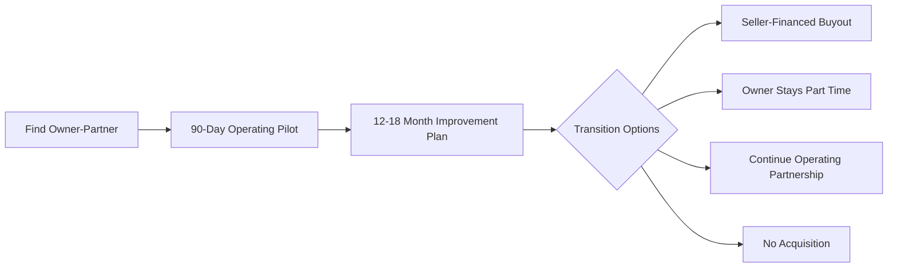
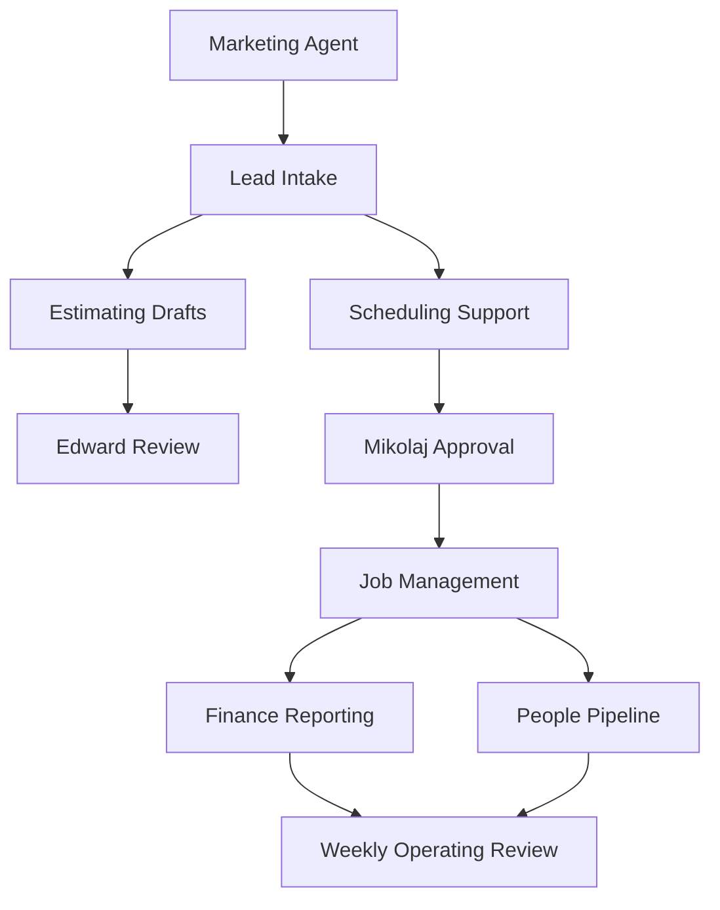

# Executive Slide Deck Source

## Slide 1: Construction Operating Group

A repeatable system for partnering with succession-constrained construction business owners, improving operations, and building a professional trade services platform.

## Slide 2: The Problem

Many strong small construction businesses are trapped inside the owner:

- owner handles sales, estimating, scheduling, quality, hiring, and customer issues
- no clear family successor
- weak digital presence and limited marketing sophistication
- limited financial and job-cost visibility
- hard to sell without damaging employees, customers, or reputation

## Slide 3: The Opportunity

Retiring owner-operators may prefer a trusted transition partner over a cold financial buyer. The right operating team can preserve legacy, improve performance, and create a path to gradual exit.

## Slide 4: Initial Operating Team

- Filip: system architect and part-time operator
- Mikolaj: principal hands-on operator
- Edward: estimating, trade knowledge, field quality, and client relations specialist
- Business Owner A: first owner-partner

## Slide 5: Operating Partnership Before Acquisition

## Slide 6: Value Creation Levers

- lead generation and response speed
- quote quality and follow-up
- job-costing and gross margin
- project management and schedule reliability
- crew quality and training
- customer communication and reviews
- owner delegation and reduced dependency

## Slide 7: Agent-Assisted Operating System

## Slide 8: First 12 To 18 Month Proof Plan

The first launch should prove:

- revenue improvement
- profitability improvement
- owner-hour reduction
- cleaner financial reporting
- repeatable operating cadence
- documented acquisition and onboarding playbook

## Slide 9: Platform Expansion

After stabilizing the first business, add complementary trades such as electrician, plumber, HVAC, or finishing specialists using the same screening, onboarding, and operating system.

## Slide 10: Investor Proof Needed

Before raising serious acquisition capital, the team should produce:

- signed owner-partner pipeline
- pilot operating results
- baseline and post-improvement financials
- documented playbook
- legal structure
- acquisition criteria
- management capacity plan

