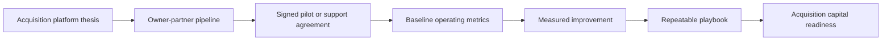

# Executive Summary

## Concept

Build a construction operating group by partnering with aging owner-operated trade businesses that have real customer demand and field knowledge but weak succession, systems, marketing, and operational leverage.

The operating team helps the owner improve performance over 12 to 18 months, gradually reduces owner dependency, and creates optionality for a seller-financed acquisition, staged transition, or long-term operating partnership.

## Why Now

Many small construction businesses are still built around the founder. If the founder is tired, lacks a successor, and has not professionalized systems, the business may be hard to sell despite real local value. A practical operating team can preserve the owner's legacy while creating a more valuable, transferable company.

## Initial Team

- Filip: part-time operator, system architect, business owner, agentic operations lead
- Mikolaj: principal hands-on operator
- Edward: experienced construction specialist, estimating and field-quality lead
- Business Owner A: first owner-partner, still to be identified

## Value Creation System

- professional digital presence
- lead intake and follow-up discipline
- estimating and quoting system
- project management cadence
- field quality standards
- hiring, onboarding, and training system
- financial reporting and job-costing
- agent-assisted administrative workflows
- incentive design that aligns owners, operators, workers, customers, and investors

## Why Participants Win

The platform is designed as a repeated game rather than a one-time acquisition. Owners gain time, income, dignity, and a transition path. Operators are paid for measurable value creation. Workers gain stability, training, and advancement. Customers get better communication and quality. Investors get exposure to a de-risked operating playbook rather than an unsupported roll-up thesis.

## Target Outcome

Within 12 to 18 months of the first partnership:

- improve revenue and profitability
- reduce owner dependency
- create clean reporting
- prove repeatable operating playbook
- prepare for acquisition, continued partnership, or expansion

## Investor Proof Path

